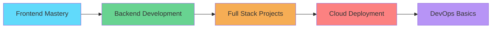

<div align="center">
  
# 👨‍💻 Merugula Chaitanya

### 🚀 Full Stack Developer | React Enthusiast | Problem Solver


</div>

---

## 🌟 About Me

```javascript
const chaitanya = {
    education: "Graduate in Electronics & Communication Engineering",
    currentFocus: "Full Stack Web Development",
    location: "India 🇮🇳",
    passion: ["Clean Code", "User Experience", "Problem Solving"],
    currentlyLearning: ["Advanced React Patterns", "Node.js", "Cloud Technologies"],
    funFact: "I turn coffee into code! ☕➡️💻"
};
```

<div align="center">

### 🎯 **"Building the web, one component at a time"**

</div>

---

## 🛠️ **Tech Arsenal**

<div align="center">

### **Frontend Magic** ✨


### **Backend Power** 🔥


### **Tools & Technologies** 🔧


</div>

---

## 📊 **GitHub Analytics**

<div align="center">
  
  
</div>

<div align="center">
  
</div>

---

## 🚀 **Featured Projects**

<div align="center">

### 🏔️ **Ooty Travels Platform**
*Modern Travel Booking Experience*


</div>

```
✨ Responsive travel booking platform with modern UI/UX
🎯 React hooks & state management for dynamic components  
📱 Mobile-first responsive design approach
🔌 REST API integration for real-time data
⚡ Cross-browser compatibility & performance optimization
```

<div align="center">

**[🔗 Live Demo](#) | [📝 Source Code](https://github.com/chaitu347/ooty-travels)**

---

### ⚖️ **Finvis Legal Services**
*Professional Consultation Platform*


</div>

```
🏛️ Professional lawyer consultation booking system
📋 Dynamic form validation & submission handling
💼 Modern component-based architecture
🎨 Enhanced user experience with ES6+ features
📱 Fully responsive across all device types
```

<div align="center">

**[🔗 Live Demo](#) | [📝 Source Code](https://github.com/chaitu347/finvis-associates)**

---

### ✅ **Smart Task Manager**
*Productivity App with Modern Features*


</div>

```
📝 Full CRUD functionality with intuitive interface
💾 Local Storage API for data persistence
⚡ Performance optimized with modern JavaScript
🎯 Interactive task management features
🔄 Real-time updates and DOM manipulation
```

<div align="center">

**[🔗 Live Demo](#) | [📝 Source Code](https://github.com/chaitu347/todo-app)**

</div>

---

## 📈 **Skills Proficiency**

<div align="center">

| Technology | Proficiency | Experience |
|------------|-------------|------------|
| **Frontend Development** | ████████░░ 80% | Building responsive UIs |
| **React & JavaScript** | ████████░░ 85% | Component architecture |
| **Database Technologies** | ███████░░░ 75% | SQL optimization |
| **Problem Solving & DSA** | ███████░░░ 70% | Algorithmic thinking |
| **REST API Integration** | ██████░░░░ 65% | Backend connectivity |
| **Version Control (Git)** | ████████░░ 80% | Collaborative development |

</div>

---

## 🏆 **Achievements & Certifications**

<div align="center">

🥇 **HackerRank Gold Badge** - Advanced SQL  
🥈 **HackerRank Silver Badge** - Java Programming  
📜 **Data Structures & Algorithms** - Apna College  
🎯 **Complex Query Optimization** - Database Management  

</div>

---

## 🎯 **Current Learning Path**

<div align="center">



</div>

### 🌱 **2025 Goals**
- [ ] Master **Node.js & Express.js** for backend development
- [ ] Build **5 full-stack applications** with modern tech stack
- [ ] Learn **TypeScript** for better code quality
- [ ] Explore **Cloud technologies** (AWS/Azure)
- [ ] Contribute to **open source projects**
- [ ] Start a **technical blog** sharing learning journey

---

## 🌐 **Let's Connect & Collaborate**

<div align="center">

[](https://linkedin.com/in/merugula-chaitanya)
[](https://github.com/chaitu347)
[](#)
[](mailto:chaitu347347@gmail.com)

</div>

---

<div align="center">

### 💡 **"Code is like humor. When you have to explain it, it's bad."** 


</div>

---

<div align="center">

## 🎵 **Currently Coding To**

[](https://open.spotify.com/user/YOUR_SPOTIFY_ID)

*When I'm not coding, you can find me exploring new technologies, solving algorithmic challenges, or planning my next project!* 🚀

</div>

---

<div align="center">
  
</div>

<div align="center">

**⭐️ From [Merugula Chaitanya](https://github.com/chaitu347) | Building the future, one commit at a time! 🚀**

</div>
